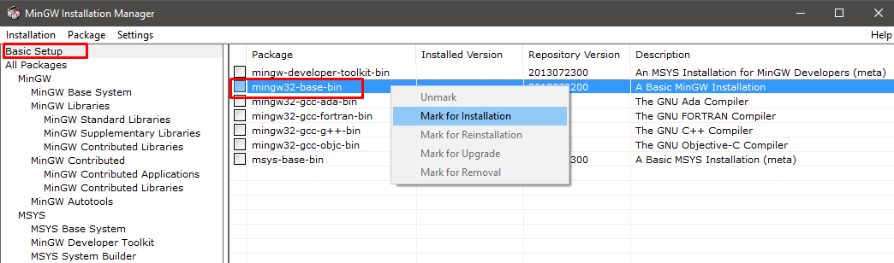
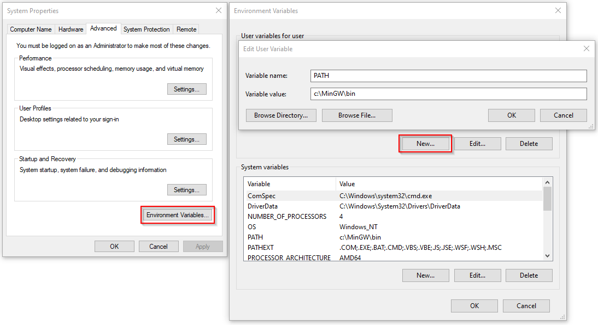
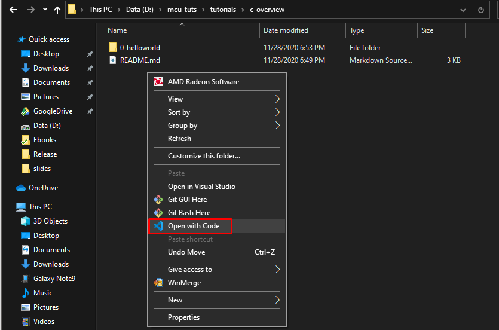
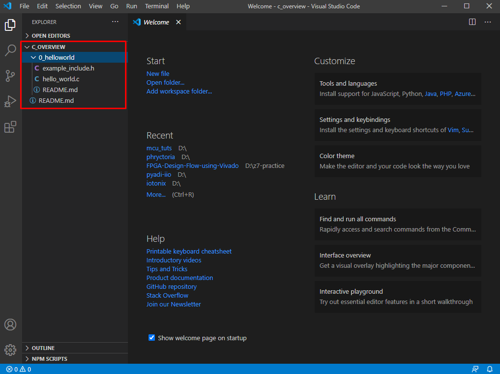

# C Tutorials Overview
## Introduction
In this tutorial series, you will be reviewing C by studying the topic linked to the given examples. This is a self-study guide designed to let the audience work on examples and guide them on what they need to learn. Each topic will have examples with comments. On each example code, you might need to change or add some lines to complete the code. Since this is just a review, you won't be using yet a cross-compiler. You will need a cross-compiler if you will be building for a different architecture. But, the concept will be the same.

## Objectives
In this overview, you will be able to:
* Install basic C programming tools
* Review the C programming language

## Preparations
You will need to install the following tools to be able to follow the examples:
1. Text Editor - Visual studio code is highly recommend. But, you may use your preferred editor.
2. Terminal - To avoid dependence on specific IDE and to give you a better understanding on build automation, we will be using a terminal for command line interface-based building.
3. Compiler - You will be needing a compiler to build codes in C into binaries. We will be using GCC. If you think that devcpp or Code-blocks is a compiler, read the difference of a compiler and an IDE.
4. build tools - You will need to install "make".

### Installation
#### Windows
1. Install your text editor. If you will be using Visual studio code, download and install [this](https://code.visualstudio.com/download). Select the approapriate installer (i.e. Use x64-bit installer for 64-bit machines).
2. On windows, you already have a built in terminal. But you can install other terminals. For this tutorial, we will just use powershell.
3. Compiler. As much as possible, we won't be using third-party libraries in this tutorial. So, MinGW GCC is enough. You can download MinGW [here](https://osdn.net/projects/mingw/releases/).Select the mingw-get-setup.exe. \
\
This installer will install the toolchain you need to build C applications. Double-double click the installer and follow the installer's instruction until you reach the Installation Manager. Select the basic setup and click the mingw32-base-bin as show in the figure below.

To apply the the changes in the packages, from the Menu in the top left corder, click Installation->Apply Changes. This will download the tools.\
\
To check if the compiler is in installed, open a powershell window and type the following:
   ```PS
   gcc --version
   ```
   This should return the version of compiler. For example:
   ```PS
   PS D:\> gcc --version
   gcc.exe (x86_64-posix-seh-rev0, Built by MinGW-W64 project) 8.1.0
   Copyright (C) 2018 Free Software Foundation, Inc.
   This is free software; see the source for copying conditions.  There is NO
   warranty; not even for MERCHANTABILITY or FITNESS FOR A PARTICULAR PURPOSE.
   ```

4. You might already have make from the mingw32 installation. You can try running from powershell the following.
   ```cmd
   make --version
   ``` 
   This should return the version of your make like this:
   ```cmd
   PS C:\> make --version
   GNU Make 3.81
   Copyright (C) 2006  Free Software Foundation, Inc.
   This is free software; see the source for copying conditions.
   There is NO warranty; not even for MERCHANTABILITY or FITNESS FOR A
   PARTICULAR PURPOSE.
   ```

5. In case Steps 3 or 4 does not return the mingw versions, manually add the bin folder into your machine's Environment Variables. Afterwhich, recheck the mingw versions done in the previous steps to verify your installation is successful. 



That's it! You are now ready to start the C tutorial.
## Accessing the Tutorials
Each topic is inside a folder in this format N_topic, where N is the number of the tutorial and topic is the topic covered by the tutorial. When accessing each tutorial, read the instructions in the README files in the folder.  

There are two ways to open the source codes. 
### Option 1: From the explorer window
You can navigate to this c_overview folder via the explorer windows, right-click in any empty area, and select Open with Code as shown in the image below.


This will open Visual studio code and treat the folder as your project folder. Which will show the other files and folders of this below this folder as shown in the figure below.


### Option 2: From the powershell
You can navigate to the c_overview folder using the `cd` command. For example, assuming you are currently in the C:\mcu_tuts\ folder, run the following command
```PS
PS D:\mcu_tuts> cd .\tutorials\c_overview\
```

You will then be inside the c_overviews folder as shown below.
```PS
PS D:\mcu_tuts\tutorials\c_overview>
```

Run Visual Studio code by running `code .` as shown in the figure below.
```PS
PS D:\mcu_tuts\tutorials\c_overview> code .
```
## Topics
[Tutorial 0: Hello World](0_helloworld/README.md)  
[Tutorial 1: Variables and Operators](1_variables_and_operators/README.md)  
[Tutorial 2: Conditional Statements](2_conditionals/README.md)  
[Tutorial 3: Loops](3_loops/README.md)  
[Tutorial 4: Functions](4_functions/README.md)  
[Tutorial 5: Arrays and Pointers](5_arrays_and_pointers/README.md)  
[Tutorial 6: C Structures](6_struct/README.md)  
[Tutorial 7: Enumerations and Type definition](7_enums_and_typedef/README.md)  
[Tutorial 8: Using make](8_using_make/README.md)  

___
This ends the C tutorial.  
Go to [MCU Tutorial](../mcu_tutorial/README.md)  
Go back to the main [README](../../README.md)